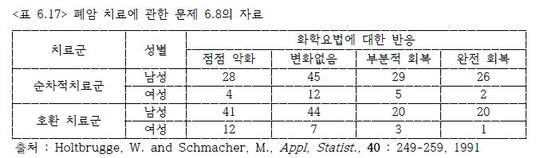
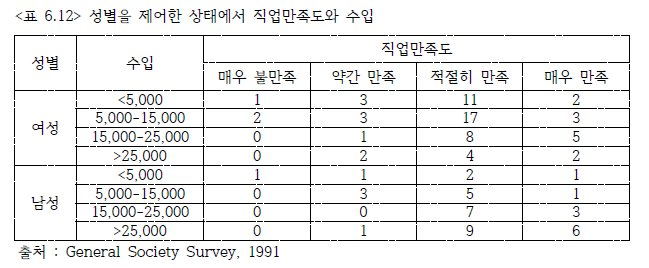

## 성 명: 지 용 기
## 연 락 처: 010-9828-0332, braveji@hanmail.net
## 학 번: 201685-010100

---

### 6.8 <표 6.17>은 미세 세포 폐암의 치료에 대한 임상시험 결과이다. 환자들은 임의적으로 두 개의 치료군으로 배정되었다. 하나의 각 치료 사이클에서 동일한 조합의 화학요법 치료제를 받도록 하는 순차적 치료군이고, 다른 치료군은 3개의 서로 다른 화학요법 치료제를 치료 기간마다 바꾸어 가면서 받도록 하는 호환적 치료군이다.



```{r}
#install.packages('VGAM')
library(VGAM)
```


#### a. 치료군과 성별의 주효과를 갖는 누적 로짓 모형을 적합하고 추정된 효과를 해석하라.

```{r}
lung_cancer.raw <- read.csv( 'chap09_report_01.csv', header=TRUE )
lung_cancer.raw
summary( lung_cancer.raw )
```

```{r}
lung_cancer <- lung_cancer.raw
lung_cancer$treatment <- factor( lung_cancer$treatment, levels=c(1, 0), labels=c('순차적', '호환') )
lung_cancer$gender <- factor( lung_cancer$gender, levels=c(1, 0), labels=c('남성', '여성') )
lung_cancer
summary( lung_cancer )
```


```{r}
lung_cancer.fit <- vglm( cbind(y1, y2, y3, y4) ~ treatment + gender, family = cumulative(parallel = TRUE), data=lung_cancer  )
summary(lung_cancer.fit)
```

tremtment의 효과는 아주 유효(p값: 0.00613)하고, gender의 효과는 유효하지 않지만(p값: .06671), 무시할 수 없는 수준으로 나옴.

treamtment가 호환 치료군은 순처적 치료군에 비해서 1.787262 배 만큼 오즈비가 높음.
여성을때 남성에 비해서  오즈비가  1.718403배가 높음.


#### b. 치료군과 성별의 교호작용항을 포함하는 모형을 적합하라. 추정된 치료군의 효과가 성별에 따라 어떻게 다르게 나타나는지 보여서 교호작용항을 해석하라.


```{r}
lung_cancer.fit2 <- vglm( cbind(y1, y2, y3, y4) ~ treatment * gender, family = cumulative(parallel = TRUE), data=lung_cancer  )
summary(lung_cancer.fit2)
```

trement 가 호환이고, 여성일때 그렇지 않을때보다 오즈비가 1.8047 높음.


#### c. 교호작용을 포함한 모형이 더 유의하게 좋은 적합 결과를 보이는가?

treament 효과는 유효(p-value : 0.0329 )하지만, gender와 treatment:gender 교호작용 효과는 유효하지 않음.


### 6.11 <표 6.12>의 직업만족도가 반응변수인 자료를 참조하여 누적 로짓 모형을 이용하여 자료를 분석하라.




#### a. 점수 {3, 10, 20, 35}를 이용하여 수입 효과를 분석하라.

```{r}
job.raw <- read.csv( 'chap09_report_02.csv', header=TRUE )
job.raw
summary( job.raw )
```


```{r}
job <- job.raw
job$gender <- factor( job$gender, levels=c(1, 0), labels=c('남성', '여성') )
job
summary( job )
```


```{r}
job.fit <- vglm( cbind(y1, y2, y3, y4) ~ gender + income , family = cumulative(parallel = TRUE), data=job  )
summary(job.fit)
```

gender은 직업만족도를 영향이 없고, 
income은 한단위 증가할때마다 오즈비가 0.954 만큼 낮아짐.

#### b. 위에서 추정된 수입 효과와 “매우 불만족”과 “약간 만족”의 두 범주를 합한 후에 추정된 값을 비교하라. 이 결과에서 모형의 어떤 특징이 반영되는가?


```{r}
library(dplyr)
job_new <- mutate( job, y0 = y1 + y2 )
job_new
```

```{r}
job_new.fit <- vglm( cbind(y0, y3, y4) ~ gender + income , family = cumulative(parallel = TRUE), data=job_new  )
summary(job_new.fit)
```

gender은 직업만족도를 영향이 없고, 
income은 한단위 증가할때마다 오즈비가 0.955 만큼 낮아짐.
거의 차이가 없음.

#### c. 문제 (a)의 모형에서 성별변수를 제거할 수 있는가?

gender의 효과는 p-value가 0.962로 전혀 없기 때문에 제거 할 수 있음.

